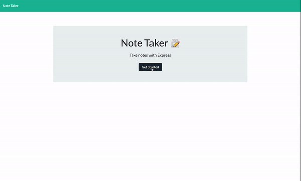

  <h1 align="center">Note Taker</h1>
  
   

  ## Description
  Create an application that can be used to write, save, and delete notes. This application will use an express backend and save and retrieve note data from a JSON file.

  ## Table of Contents
  - [Description](#description)
  - [Installation](#installation)
  - [Usage](#usage)
  - [License](#license)
  - [Contributing](#contributing)
  - [Questions](#questions)

  ## Installation
  First run `npm i` in order to install the dependencies. The application itself can be invoked with `node server.js` in the intergreated termeinal through the `server.js` file.

  ## Usage
  
  
  When you run `node server.js` in the intergrated terminal, it will let you know `App listening localhost: 3000`. Once you see this, go to your prefered browswer and type in `localhost:3000`. The Note Taker app is live on Heroku for your use.   

  Here is a link to the deployed site on [heroku](https://arcane-reaches-69511.herokuapp.com/).

  ## License
  [MIT License](https://choosealicense.com/licenses/mit/)

  ## Contributing
  Please message with me any errors or improvements you may have. See the [Questions](#questions) section to contact me.

  ## Questions
  - My GitHub profile: [justinkvang](http://github.com/justinkvang)
  - My GitHub repository: [justinkvang](http://github.com/justinkvang?tab=repositories)
  - Email me with any questions: justinvang07@gmail.com